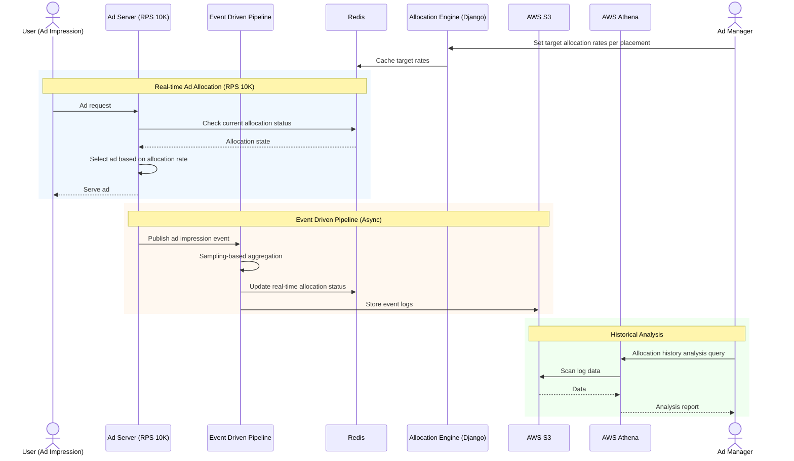

# Buzzvil

> Backend Engineer | May 2021 – Oct 2021

Developed ad allocation logic for a high-traffic (RPS 10K) ad server and maintained OLAP data processing pipelines at Buzzvil, a reward advertising platform.

---

## Tech Stack

| Category | Technologies |
|----------|-------------|
| **Language** | Python |
| **Framework** | Django |
| **Database / Storage** | Redis, S3 |
| **Analytics** | AWS Athena |
| **Architecture** | Event Driven Pipeline |

---

## Project Details

### 1. Ad Allocation Logic

Developed a system to approximate target ad allocation rates set by managers across different ad placements on an RPS 10K ad server.

Tech Stack: Python, Django, S3, Athena, Redis

#### Problem

- Each ad placement had manager-defined target allocation rates
- Required real-time allocation rate control under high traffic (RPS 10K)
- Accurate allocation needed without adding server load

#### Solution

- **Event Driven Pipeline**: Asynchronously collected ad impression events to track allocation status in real-time. Reduced coupling and improved scalability
- **Sampling**: Estimated allocation status via sampling instead of full enumeration. Minimized server load while reaching target confidence levels
- Redis-based real-time counters and allocation state caching
- S3 + Athena for historical data analysis and reporting

#### Result

- Achieved target allocation confidence without server load impact
- Stable ad allocation system operation at RPS 10K

---

### 2. OLAP Server Maintenance

Operated and maintained the OLAP (Online Analytical Processing) service for advertising data analysis.

- Overall OLAP service operation and management
- Data processing pipeline modifications for new feature additions
- Analytics metric additions and data consistency management

---

## Architecture

