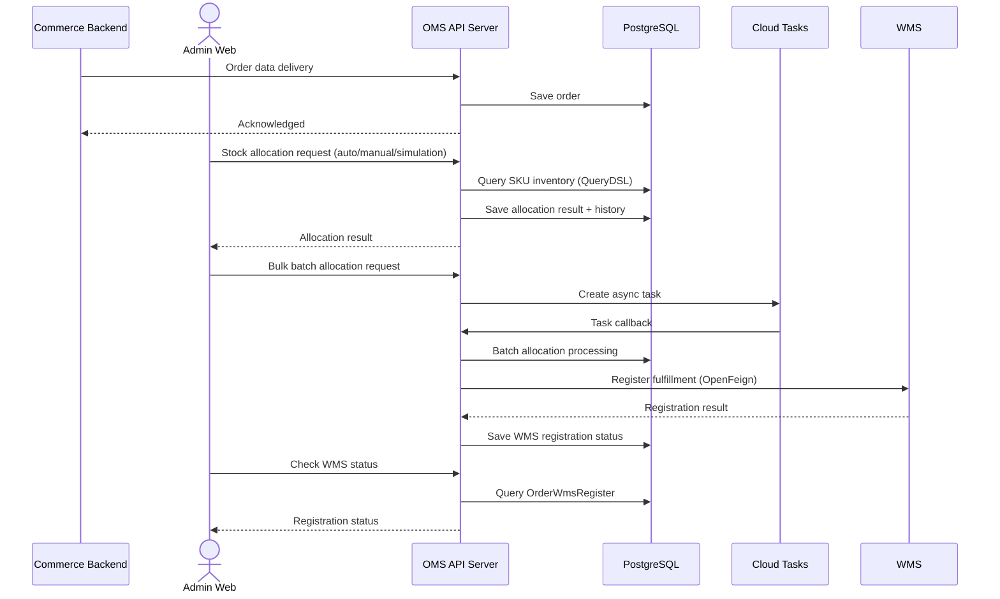
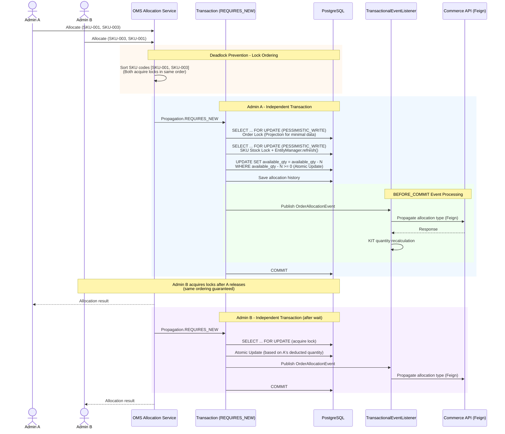
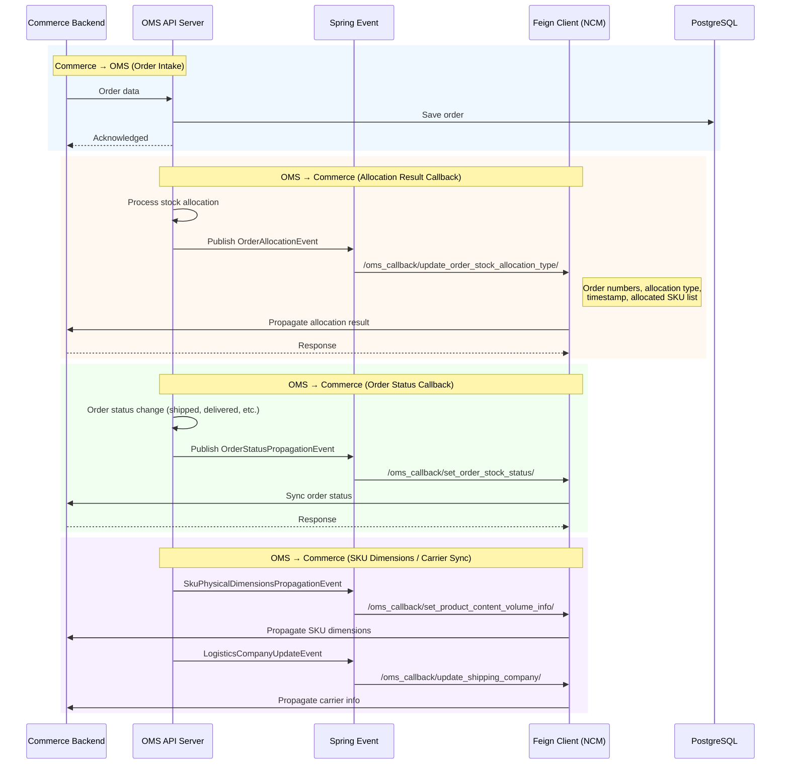
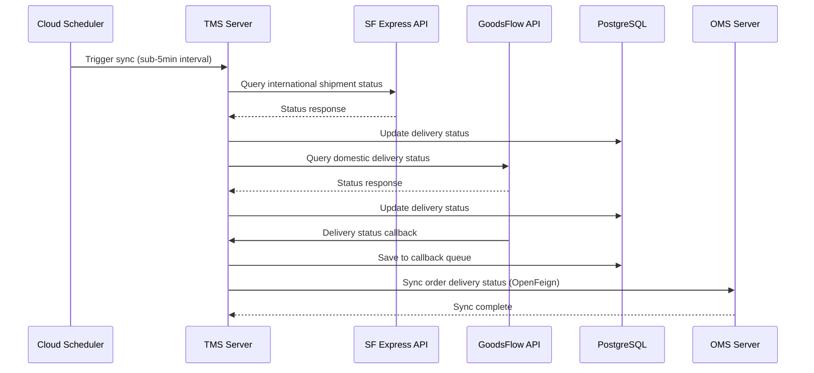

# MakeStar

> Backend Engineer | May 2024 – Present

Backend development for OMS (Order Management System), TMS (Transportation Management System), and logistics systems at MakeStar, a global K-POP commerce platform.

---

## Tech Stack

| Category | Technologies |
|----------|-------------|
| **Language** | Java 21, Kotlin |
| **Framework** | Spring Boot 3.5.x, Spring Security 6.x, Spring Cloud (OpenFeign) |
| **ORM / Query** | JPA (Hibernate 6.x), QueryDSL 5.x, MyBatis 3.x |
| **Database** | PostgreSQL, Redis |
| **Cloud** | GKE, Google Cloud Tasks, Google Cloud Scheduler, GCP Container Registry |
| **DevOps** | Docker, GitHub Actions, Flyway |
| **Testing** | JUnit 5, Mockito, MockK, WireMock, TestContainers |

---

## Project Details

### 1. OMS (Order Management System) Backend

Core order management system handling the full order lifecycle — from order intake to stock allocation, fulfillment, and delivery.

#### Order Processing

- Designed and developed RESTful APIs for order creation, querying, modification, and status management
- Orders are received from the Commerce backend; OMS manages all downstream processing
- Implemented complex search functionality with QueryDSL-based dynamic queries (order status, date, customer, product filters)
- Event-driven processing for order status changes via Spring Events
- Automated API documentation with SpringDoc OpenAPI

#### Stock Allocation System

**Key achievement** — Designed a stock allocation system that solved complex business requirements and eliminated the core operational bottleneck of manual spreadsheet-based allocation.

- Single WMS environment stock allocation system design and development
- **Automatic Allocation**: Rule-based order-to-inventory matching
- **Manual Allocation**: Admin-selected SKU assignment for special cases
- **Simulation Mode**: Preview allocation results before committing
- KIT product handling — automatic calculation of component SKU quantities
- Allocation history tracking for audit trails (OrderAllocationHistory)

#### Stock Allocation Concurrency Control

Multi-layered concurrency control strategy ensuring data consistency when multiple admins allocate stock simultaneously.

- **Pessimistic Locking**: `PESSIMISTIC_WRITE` locks applied at 3 levels — Order, LineItem, StockItemQuantity
- **Deadlock Prevention**: SKU codes sorted before lock acquisition for consistent Lock Ordering; single IN-clause query for bulk locking
- **Lock Projection**: Projection interfaces instead of full entity loading to minimize data overhead
- **Atomic Update**: WHERE clause with `quantity >= 0` constraint prevents negative inventory at DB level
- **JDBC Batch Update**: Bulk allocation via JDBC batchUpdate instead of JPA for reduced transaction overhead
- **Transaction Isolation**: `Propagation.REQUIRES_NEW` per allocation unit for independent transactions
- **TransactionalEventListener (BEFORE_COMMIT)**: KIT quantity recalculation triggered as pre-commit event

#### Commerce System Integration

Event-driven integration for real-time data synchronization between OMS and Commerce backend.

- **OpenFeign-based Commerce API integration**: Propagates order stock status, SKU dimensions, carrier info, and allocation type via callback pattern
- **Spring TransactionalEventListener (BEFORE_COMMIT)**: Commerce API called at pre-commit phase, ensuring rollback on failure for transactional consistency
- Bidirectional communication: Commerce → OMS (order intake), OMS → Commerce (allocation/status callbacks)

#### WMS Integration

- OpenFeign-based WMS fulfillment registration API integration
- Tracking WMS registration status per order (OrderWmsRegisterEntity)
- Async bulk WMS registration via Cloud Tasks
- Retry handling and status management for registration failures

#### Async Batch Processing

- Async task processing architecture with Google Cloud Tasks
- Batch allocation, order reset, WMS registration as async operations
- Task status tracking and retry logic
- Cloud Scheduler for periodic jobs (delivery status synchronization)

---

### 2. Shipping Cost Calculation System

Dynamic shipping cost calculation supporting 10+ international carriers.

#### Cost Calculation Engine

- Multi-factor pricing based on destination country, weight, box type, and carrier
- Separate calculation logic for domestic and international shipping
- Carrier-specific policies (Hanjin, FedEx, UPS, EMS, SF Express, etc.)

#### Box Optimization

- **3D Bin Packing algorithm** for optimal box packing
- LAFF (Largest Area Fit First) algorithm as fallback strategy
- Product classification system for packaging (TUBE packaging, P1 box for photocards)
- Hanjin box type classification (S, A, B, C, D, E tiers with differential pricing)

---

### 3. TMS (Transportation Management System)

Shipment tracking and logistics provider integration.

#### Real-time Delivery Tracking

- SF Express API integration for international shipment tracking
- GoodsFlow API integration for domestic delivery status tracking
- Cloud Scheduler-based delivery status synchronization at sub-5-minute intervals

#### Callback System

- Delivery status callback reception from logistics providers (GoodsFlow)
- Callback queue system for reliable status updates
- Automatic OMS delivery status synchronization

---

### 4. Java 21 Migration & Kotlin Adoption

- Java 15 → **Java 21 LTS** upgrade
- javax → **jakarta EE** full namespace migration
- Spring Boot 3.x, Spring Security 6.x upgrade
- Kotlin-first policy for new development; gradual migration of existing Java code

---

### 5. GitHub Organization & CI/CD

- Consolidated company-wide repositories into a **single GitHub Organization**
- GitHub Actions CI/CD with independent OMS/TMS deployment pipelines
- Branch-based auto build and deploy (dev/stage/prod)

---

## Architecture

### OMS Order Processing Flow

### Stock Allocation Concurrency Control

### OMS ↔ Commerce Integration

### TMS Delivery Tracking

