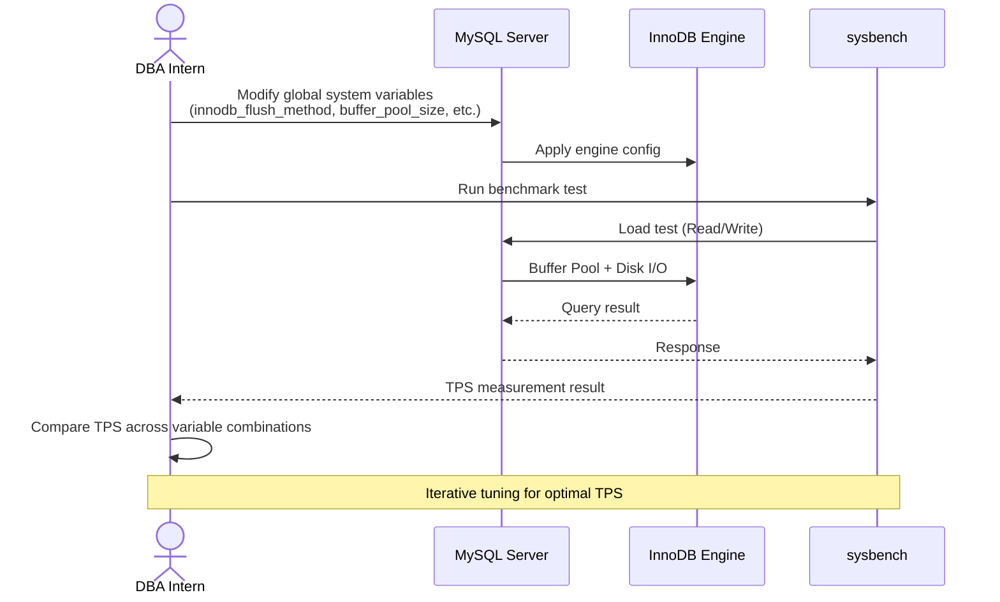
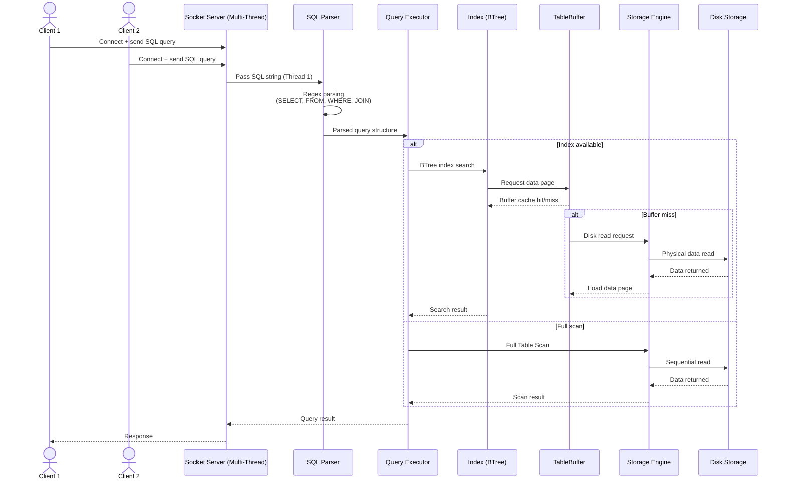

# Naver Cloud Platform

> DB Engineering Intern | Jul 2020 – Aug 2020

Database engineering internship at Naver Cloud Platform, focusing on MySQL performance tuning and implementing a Mini MySQL engine from scratch.

---

## Tech Stack

| Category | Technologies |
|----------|-------------|
| **Language** | Java |
| **Database** | MySQL |
| **Performance** | sysbench, InnoDB tuning |
| **Data Structures** | BTree, Indexing |
| **Networking** | Socket Programming |

---

## Project Details

### 1. MySQL Tuning

Tuned MySQL global system variables to maximize TPS (Transactions Per Second) in a given environment.

Tech Stack: MySQL

#### Engine Study

- Studied InnoDB storage engine internals
- Understood core components: Buffer Pool, Redo Log, Undo Log
- Deep dive into MySQL architecture

#### System Variable Tuning

- **innodb_flush_method**: Optimized disk I/O strategy
- **buffer_pool_size**: Minimized disk access through memory cache optimization
- Systematic benchmark testing with **sysbench**
- Measured TPS changes per variable combination

---

### 2. Mini MySQL Implementation

Built a Mini MySQL database engine from scratch to deeply understand MySQL internals.

Tech Stack: Java, MySQL

#### Storage Engine

- **MySQL Storage Engine**: Physical data storage and read/write handling
- **SQL Parser**: Parse SQL query strings into executable structures via regex
- **TableBuffer Handle**: Memory buffer management for table data

#### Algorithm Implementation

- **BTree**: Balanced tree for data storage and retrieval
- **Indexing**: Index structures for search performance improvement

#### Concurrency

- **Socket server** supporting multiple simultaneous client connections
- Thread management for multi-client access

#### SQL Query Support

- Basic query parsing: `SELECT`, `FROM`, `WHERE`
- **JOIN** operations
- **Range-based search**: BETWEEN, comparison operators

---

## Architecture

### MySQL Tuning Process

### Mini MySQL Query Processing Flow

