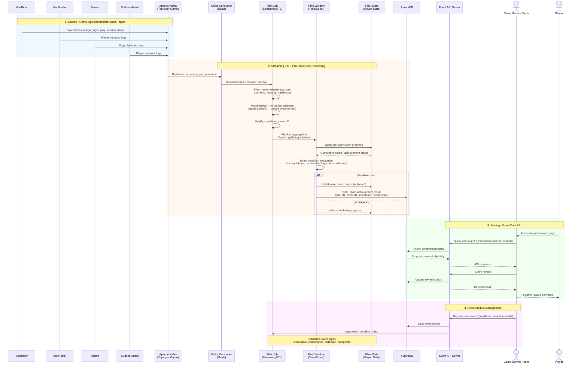
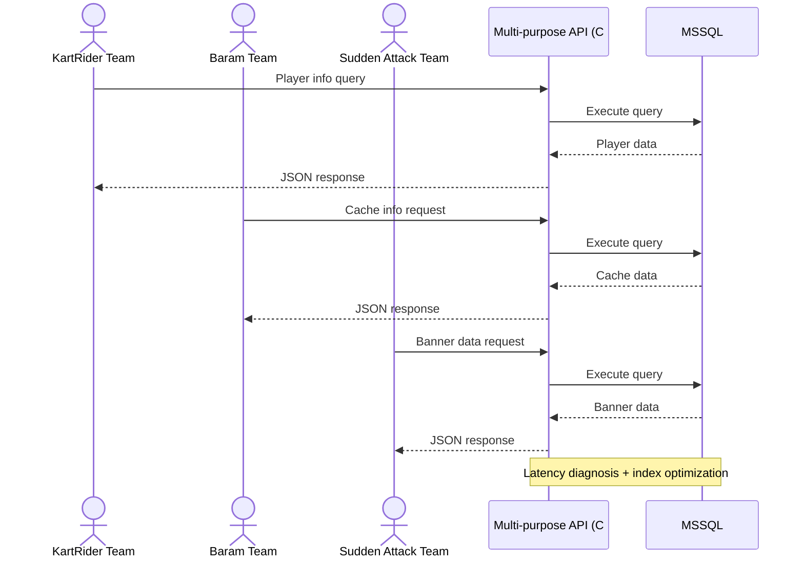

# Nexon Korea – Intelligence Labs

> Backend Engineer | Jan 2022 – Oct 2022

Developed real-time event systems and operated backend API servers for multiple game titles including KartRider, Baram (The Kingdom of the Winds), Sudden Attack, and more.

---

## Tech Stack

| Category | Technologies |
|----------|-------------|
| **Language** | Scala, C# |
| **Framework** | Apache Flink |
| **Message Queue** | Apache Kafka |
| **Database** | AuroraDB, MSSQL |

---

## Project Details

### 1. Real-time Event System

Developed a reward event system for 5+ game titles, processing player behavior logs in real-time to evaluate event conditions and serve event data.

Tech Stack: Scala, Flink, Kafka, AuroraDB

#### Realtime Streaming ETL Pipeline

---

### 2. Multi-purpose Backend API Server

Operated a shared backend API server providing player info, cache data, banners, and more for each game service team.

Tech Stack: C#, MSSQL, RDB

#### DB Performance Improvement

- Diagnosed and resolved **query latency issues**
- Execution plan analysis and index optimization
- MSSQL performance tuning

#### Service Maintenance

- API issue resolution and overall maintenance across game services
- Feature development for diverse requirements from multiple game teams
- Service stability monitoring and incident response

