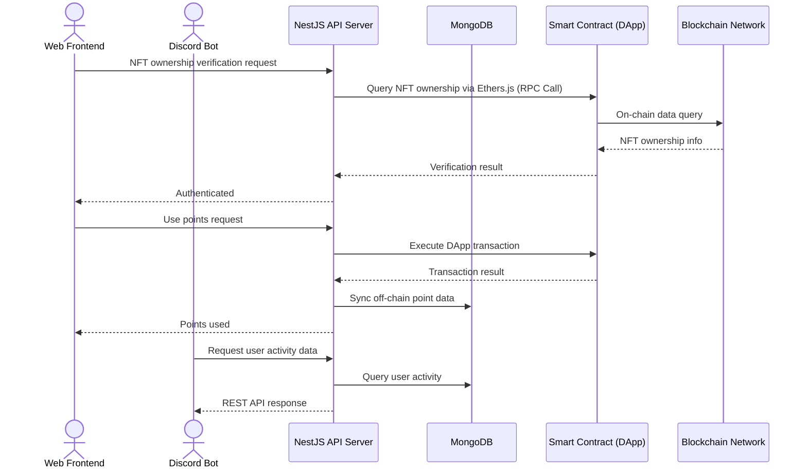
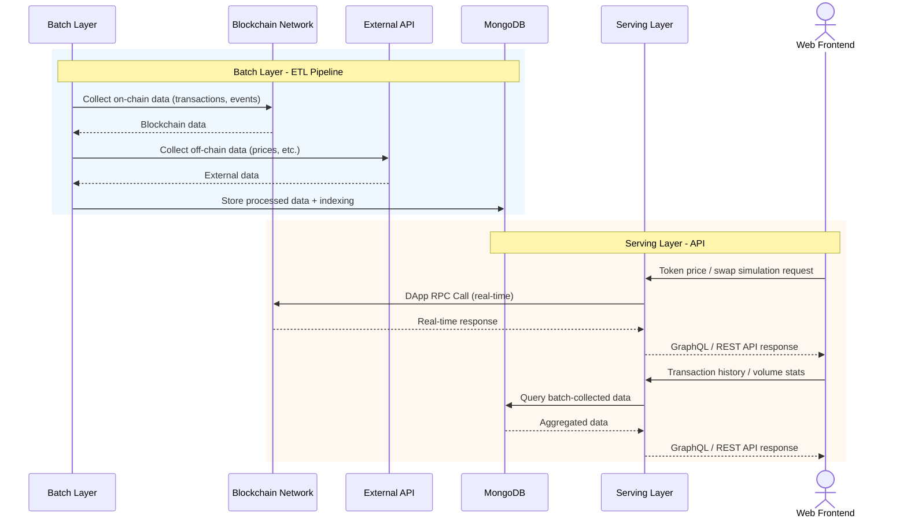

# Sooho.io

> Backend Engineer | Apr 2023 – Mar 2024

Backend development and infrastructure engineering at Sooho.io, a blockchain-based service company. Responsible for infrastructure improvements, NFT platform, and DEX (Decentralized Exchange) backend development.

---

## Tech Stack

| Category | Technologies |
|----------|-------------|
| **Language** | TypeScript |
| **Framework** | NestJS |
| **Database** | MongoDB |
| **Cloud & Infra** | AWS EKS, ECR, Fargate, S3 |
| **DevOps** | CI/CD Pipeline, Docker |
| **Monitoring** | Grafana, Prometheus |
| **Blockchain** | Ethers.js, DApp, RPC |
| **API** | GraphQL, REST API |

---

## Project Details

### 1. Backend System Improvement

Overhauled a system that had been developed as MVP without dedicated backend engineering, addressing inefficiencies and operational issues.

#### Container Infrastructure

- Introduced **AWS EKS cluster** for container orchestration
- Established Docker image management via **ECR** (Elastic Container Registry)
- Adopted **Fargate** for serverless container execution, reducing infrastructure management overhead

#### CI/CD Pipeline

- Replaced manual deployment with automated CI/CD pipeline
- Full automation from code push through build, test, and deployment

#### APM Introduction

- Built monitoring system with **Grafana + Prometheus**
- Service metric collection and dashboard visualization
- Alert system for rapid incident detection and response

#### API Efficiency

- Introduced **GraphQL** for query-heavy servers
- Enabled selective data fetching, eliminating over-fetching/under-fetching

---

### 2. NFT Platform Backend

Designed and built the backend for a platform serving NFT holders.

Tech Stack: EKS, TypeScript, NestJS, MongoDB, Ethers.js, Blockchain

- Data modeling and system architecture design
- On-chain/off-chain data consistency logic between DApp and DB
- Smart contract integration via Ethers.js
- REST API for frontend web and Discord bot integration

---

### 3. DEX (Decentralized Exchange) Backend

Designed and built the backend system for a decentralized exchange.

Tech Stack: EKS, TypeScript, NestJS, MongoDB, Ethers.js, Blockchain

#### Batch Layer

- **OnChain ETL**: Collection and processing of blockchain transactions and events
- **OffChain ETL**: External API and price data collection
- MongoDB indexing optimization for collected data

#### Serving Layer

- Real-time API via **DApp RPC Calls** — token prices, liquidity pool info, swap simulation
- **GraphQL** and **REST API** serving batch-collected data — transaction history, liquidity trends, volume statistics
- Composite APIs combining real-time and batch data

---

## Architecture

### NFT Platform Flow

### DEX Backend Flow

