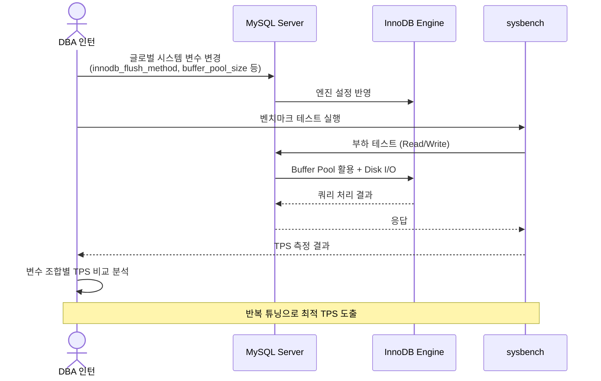
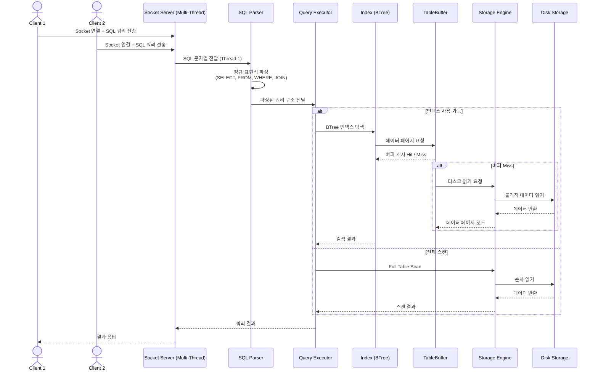

# 네이버 클라우드 플랫폼

> DBA 인턴 | 2020.07 ~ 2020.08

네이버 클라우드 플랫폼에서 데이터베이스 엔지니어링 인턴으로 근무하며, MySQL 성능 튜닝 및 Mini MySQL 구현 프로젝트를 수행했습니다.

---

## 기술 스택

| 구분 | 기술 |
|------|------|
| **Language** | Java |
| **Database** | MySQL |
| **Performance** | sysbench, InnoDB 튜닝 |
| **자료구조** | BTree, Indexing |
| **네트워크** | Socket Programming |

---

## 프로젝트 상세

### 1. MySQL 튜닝

주어진 환경에서 MySQL 글로벌 시스템 변수 등을 튜닝하여 TPS(Transactions Per Second)를 극대화하는 작업을 수행했습니다.

기술 스택 : MySQL

#### MySQL 엔진 학습

- InnoDB 스토리지 엔진의 내부 동작 원리 학습
- Buffer Pool, Redo Log, Undo Log 등 핵심 구성요소에 대한 이해
- MySQL 아키텍처 전반에 대한 깊이 있는 학습

#### 시스템 변수 튜닝

- **innodb_flush_method** 튜닝: 디스크 I/O 방식 최적화
- **buffer_pool_size** 조정: 메모리 캐시 크기 최적화를 통한 디스크 접근 최소화
- 그 외 다양한 글로벌 시스템 변수 조합 테스트
- **sysbench**를 활용한 체계적인 퍼포먼스 벤치마크 테스트 수행
- 각 변수 변경에 따른 TPS 변화 측정 및 분석

---

### 2. MySQL 설계 및 개발 (Mini MySQL)

MySQL을 깊이 이해하기 위해 직접 Mini MySQL 데이터베이스 엔진을 처음부터 구현하는 프로젝트를 수행했습니다.

기술 스택 : Java, MySQL

#### 스토리지 엔진 구현

- **MySQL Storage Engine** 구현: 데이터의 물리적 저장 및 읽기/쓰기 처리
- **Parser** 구현: SQL 쿼리 문자열을 파싱하여 실행 가능한 구조로 변환
- **TableBuffer Handle** 구현: 테이블 데이터의 메모리 버퍼 관리

#### 알고리즘 구현

- **BTree** 자료구조 직접 구현: 데이터 저장 및 탐색을 위한 균형 트리
- **Indexing** 메커니즘 직접 구현: 데이터 검색 성능 향상을 위한 인덱스 구조

#### 동시성 지원

- 여러 사용자가 **동시 접속**하여 쿼리를 실행할 수 있는 **Socket 서버** 환경 구현
- 멀티 클라이언트 접속을 위한 스레드 관리

#### SQL 쿼리 지원

- 기본 쿼리 정규 표현식 구현: `SELECT`, `FROM`, `WHERE` 등
- **JOIN** 연산 구현: 테이블 간 조인 처리
- **범위 기반 탐색** 구현: BETWEEN, 비교 연산자 등을 활용한 범위 검색
- 쿼리 실행 계획에 따른 최적 실행 경로 탐색

---

## 아키텍처

### MySQL 튜닝 프로세스

### Mini MySQL 쿼리 처리 흐름

