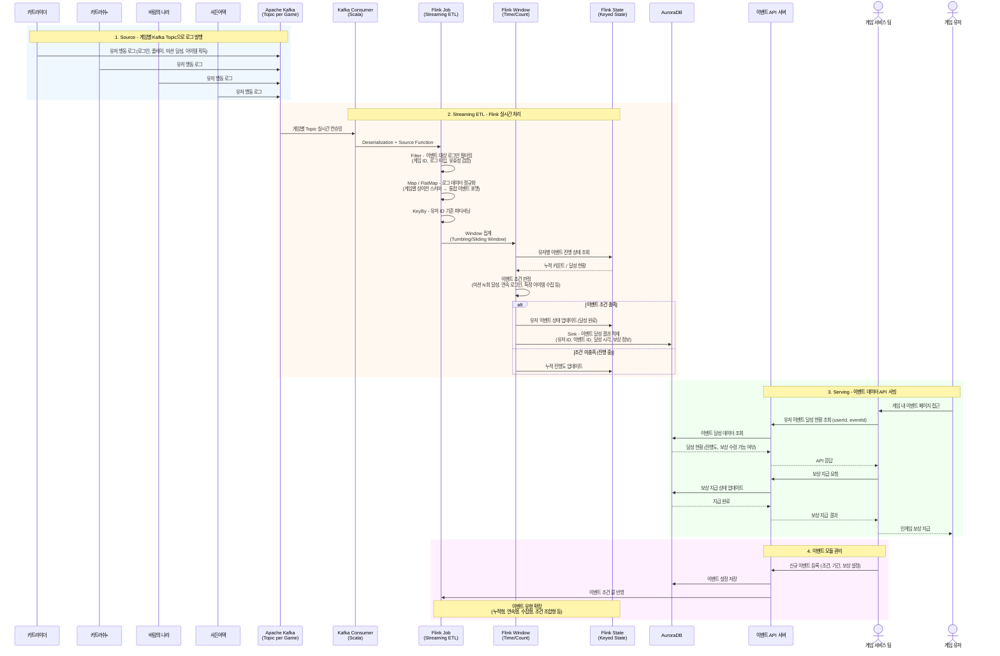
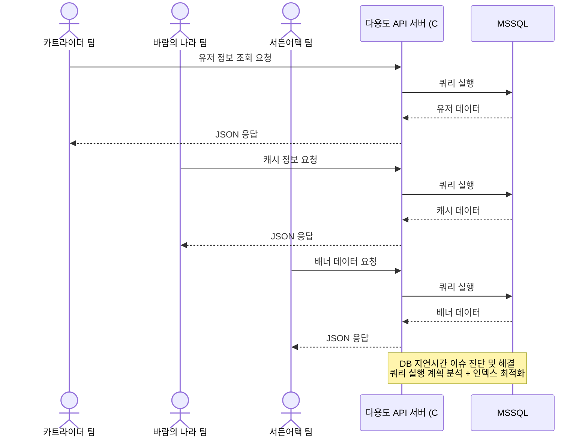

# 넥슨 코리아 - 인텔리전스 랩스

> 백엔드 엔지니어 | 2022.01 ~ 2022.10

넥슨코리아 인텔리전스 랩스에서 백엔드 엔지니어로 근무하며, 카트라이더, 바람의 나라, 서든어택 등 다수의 게임 서비스를 대상으로 실시간 이벤트 시스템 개발 및 다용도 백엔드 API 서버 운영을 담당했습니다.

---

## 기술 스택

| 구분 | 기술 |
|------|------|
| **Language** | Scala, C# |
| **Framework** | Apache Flink |
| **Message Queue** | Apache Kafka |
| **Database** | AuroraDB, MSSQL |
| **기타** | Realtime Streaming ETL |

---

## 프로젝트 상세

### 1. 실시간 이벤트 개발

카트라이더, 카트러쉬+, 바람의 나라, 서든어택 등 게임 서비스에서 유저에게 제공하는 보상 이벤트 시스템을 개발했습니다.

기술 스택 : Scala, Flink, Kafka, AuroraDB

#### Realtime Streaming ETL 구축

- **Kafka**로 컨슈밍한 게임 로그에 대해 **Flink Framework**로 Realtime streaming ETL 파이프라인 구축
- 게임 내 유저 행동 데이터(로그인, 플레이, 미션 달성 등)를 실시간으로 수집 및 가공
- 대규모 게임 로그를 안정적으로 처리하기 위한 스트리밍 아키텍처 설계

#### 이벤트 데이터 API 서빙

- 가공된 이벤트 데이터를 게임 서비스 팀에 API로 제공
- 유저별 이벤트 달성 현황, 보상 지급 상태 등의 데이터 서빙
- 이벤트 기간 동안의 트래픽 증가에 대응하는 안정적인 API 서빙

#### 이벤트 모듈 개선

- 기존 이벤트 모듈의 로직 수정 및 기능 보완
- 새로운 이벤트 유형에 대한 확장 가능한 구조로 개선
- 이벤트 조건 판정 로직 정확도 향상

---

### 2. 다용도 백엔드 API 서버 운영

게임별 유저 정보, 캐시 정보, 배너 등 각 게임 서비스 팀에서 필요한 다용도 백엔드 API 서버를 운영 및 관리했습니다.

기술스택 : C#, MSSQL, RDB

#### DB 성능 개선

- DB에서 발생하는 **지연시간(Latency) 이슈 진단 및 해결**
- 쿼리 실행 계획 분석 및 인덱스 최적화
- MSSQL 환경에서의 성능 튜닝 경험

#### 서비스 유지보수

- 각 게임 서비스별 API 문제 해결 및 전반적인 유지보수 담당
- 여러 게임 팀의 다양한 요구사항에 대한 API 개발 및 수정
- 서비스 안정성 모니터링 및 장애 대응

---

## 아키텍처

### 실시간 이벤트 Streaming ETL 파이프라인

### 다용도 백엔드 API 서버 흐름

