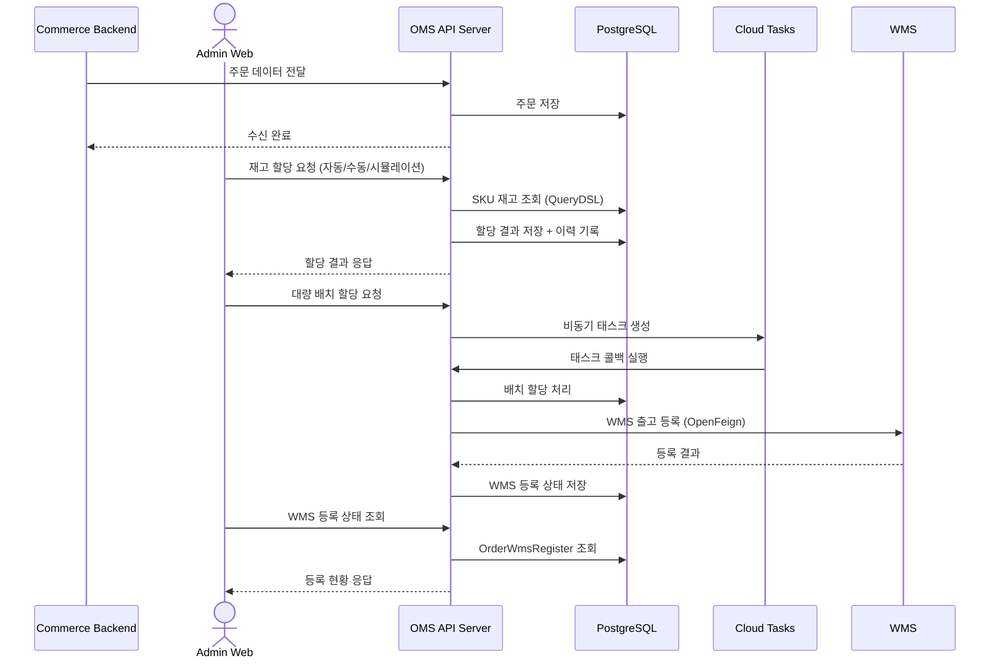
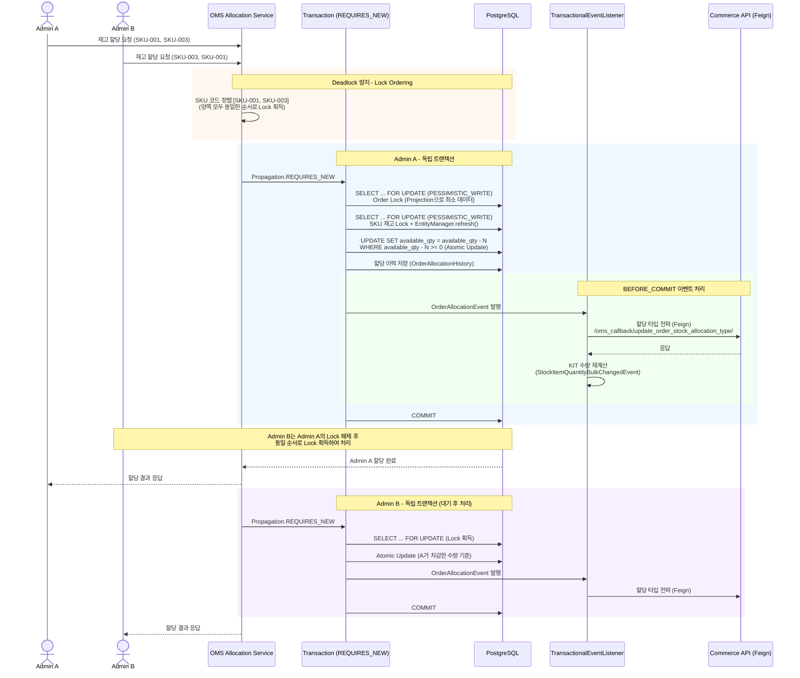
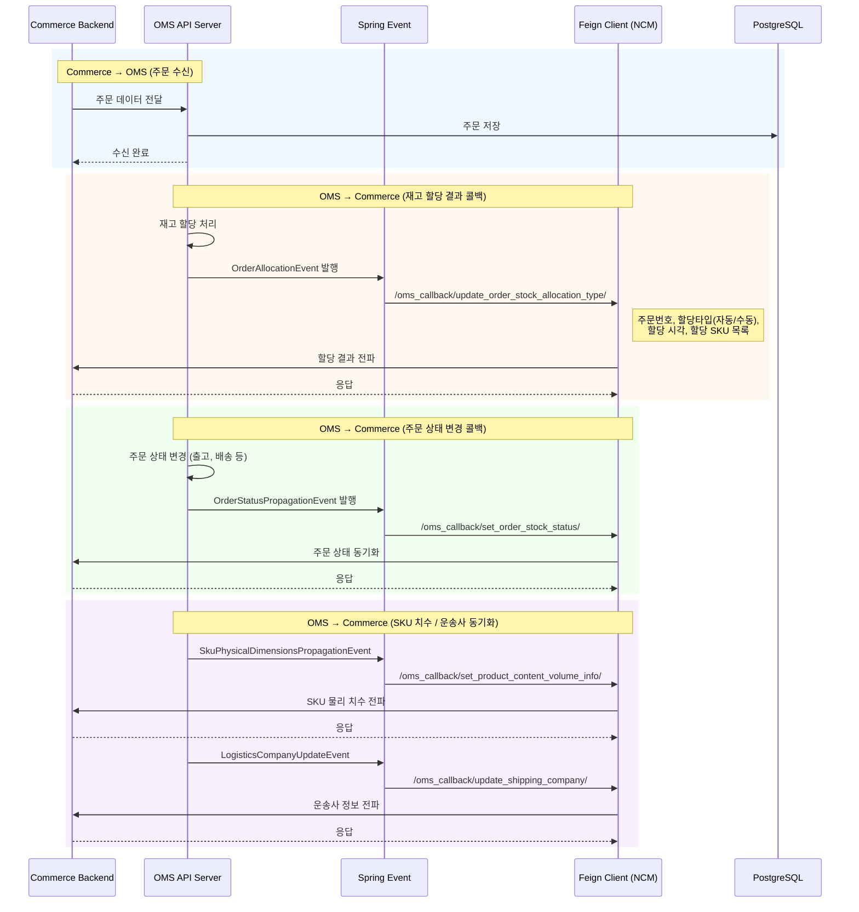
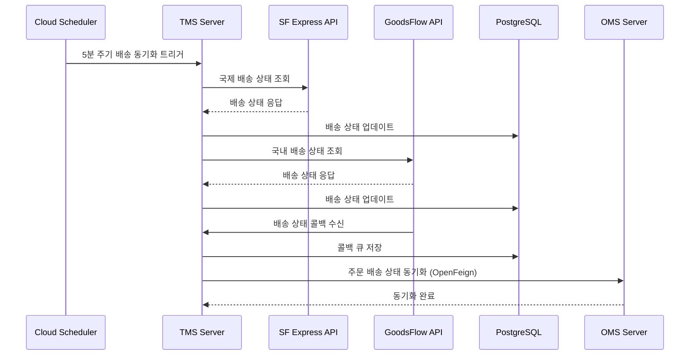
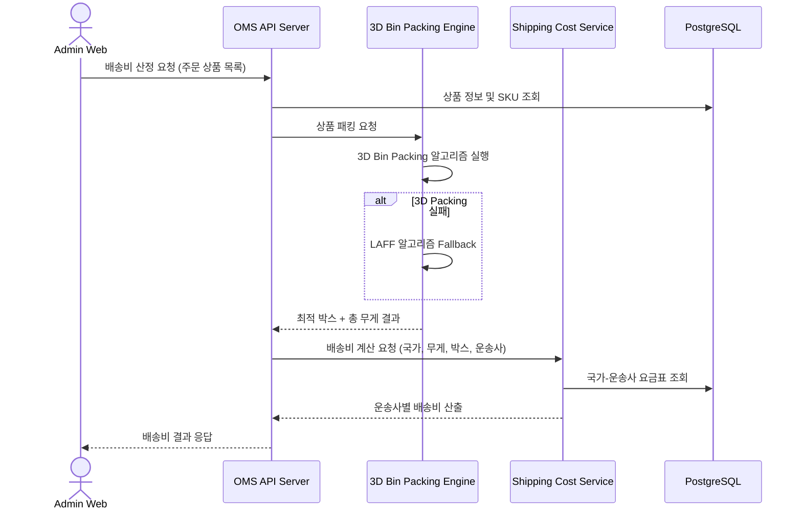
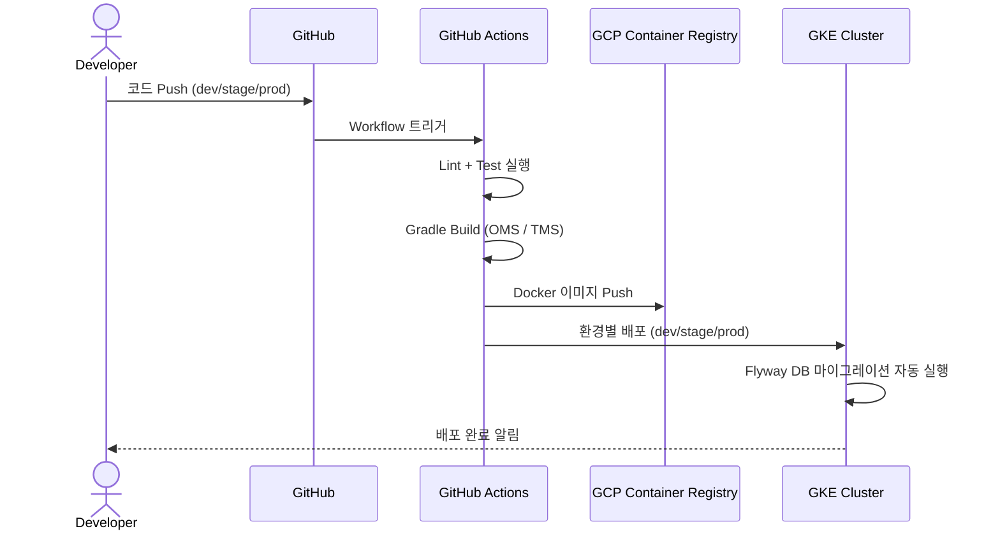

# 메이크스타(MakeStar)

> 백엔드 엔지니어 | 2024.05 ~ 현재

K-POP 글로벌 커머스 플랫폼을 운영하는 메이크스타에서 주문 관리 시스템(OMS), 운송 관리 시스템(TMS), 물류 시스템의 백엔드 개발을 담당하고 있습니다.

---

## 기술 스택

| 구분 | 기술 |
|------|------|
| **Language** | Java 21, Kotlin |
| **Framework** | Spring Boot 3.5.x, Spring Security 6.x, Spring Cloud (OpenFeign) |
| **ORM / Query** | JPA(Hibernate 6.x), QueryDSL 5.x, MyBatis 3.x |
| **Database** | PostgreSQL, Redis |
| **Cloud** | GKE, Google Cloud Tasks, Google Cloud Scheduler, Google Cloud Profiler, GCP Container Registry |
| **DevOps** | Docker, GitHub Actions, Flyway |
| **Monitoring** | Sentry, Google Cloud Profiler |
| **Testing** | JUnit 5, Mockito, MockK, WireMock, TestContainers |
| **기타** | SpringDoc OpenAPI 3.x, Apache POI, Caffeine Cache |

---

## 프로젝트 상세

### 1. OMS(Order Management System) 백엔드 개발

K-POP 커머스 플랫폼의 핵심 주문 관리 시스템으로, 주문 생성부터 재고 할당, 출고, 배송까지의 전체 주문 라이프사이클을 관리하는 백엔드 시스템을 설계 및 개발했습니다.

#### 주문 처리 시스템

- 커머스 백엔드로부터 주문을 수신하고, 조회 / 수정 / 상태 관리 등 핵심 주문 처리 RESTful API 설계 및 개발
- QueryDSL 기반 동적 쿼리를 활용한 복합 조건 주문 검색 기능 구현 (주문 상태, 날짜, 고객 정보, 상품 등 다양한 필터 조합)
- 주문 상태 변경에 따른 이벤트 기반 처리 로직 구현 (Spring Events)
- SpringDoc OpenAPI를 활용한 API 문서 자동화

#### 재고 할당 시스템

복잡한 비즈니스 요구사항(자동/수동/시뮬레이션 할당, KIT 조합, SKU별 수량 관리)을 해결하기 위한 재고 할당 시스템을 설계하여, 기존 수작업 기반 운영의 핵심 병목을 해소한 **주요 성과**입니다.

- 단일 WMS 환경에서의 재고 할당 시스템 설계 및 개발
- **자동 할당**: 할당 규칙에 따라 주문과 재고를 자동 매칭
- **수동 할당**: 관리자가 특정 SKU를 직접 선택하여 할당하는 기능
- **시뮬레이션 모드**: 실제 할당 전 미리 결과를 미리보기하여 검증하는 기능
- KIT 상품(여러 SKU 조합) 할당 시 구성 SKU별 수량 자동 계산 및 정합성 보장
- 할당 이력 추적 시스템 구현 (감사 추적용 OrderAllocationHistory)

#### 재고 할당 동시성 제어

다수의 관리자가 동시에 재고를 할당할 때 정합성을 보장하기 위한 다계층 동시성 제어 전략을 설계 및 구현했습니다.

- **Pessimistic Locking (비관적 잠금)**: 주문, 주문 라인아이템, 재고 수량(SKU) 3단계에 걸쳐 `PESSIMISTIC_WRITE` 잠금 적용
- **Deadlock 방지**: SKU 코드를 정렬(sorted)한 뒤 잠금 획득하여 일관된 Lock Ordering 보장, IN절 단일 쿼리로 다건 Lock을 한번에 획득하여 순환 대기 원천 차단
- **Lock Projection**: 잠금 시 전체 Entity 대신 Projection 인터페이스를 사용하여 불필요한 데이터 로딩 최소화
- **Atomic Update**: UPDATE 쿼리 내 WHERE 절에 수량 >= 0 조건을 포함하여 DB 레벨에서 음수 재고 방지
- **JDBC Template Batch Update**: 대량 할당 시 JPA 대신 JDBC batchUpdate로 벌크 처리하여 트랜잭션 오버헤드 감소
- **트랜잭션 격리**: 할당 단위마다 `Propagation.REQUIRES_NEW`로 독립 트랜잭션을 생성하여 할당 간 간섭 방지
- **TransactionalEventListener(BEFORE_COMMIT)**: 재고 변경 시 KIT 수량 재계산을 커밋 직전에 이벤트로 처리하여 정합성 보장

#### 커머스(Commerce) 시스템 연동

OMS와 커머스 백엔드 간의 실시간 데이터 동기화를 위한 이벤트 기반 연동 시스템을 구현했습니다.

- **OpenFeign 기반 커머스 API 연동**: 주문 재고 상태, SKU 물리 치수, 운송사 정보, 할당 타입 등을 커머스에 콜백 방식으로 전파
- **Spring TransactionalEventListener 기반 이벤트 전파**: 재고 할당, 주문 상태 변경, SKU 치수 업데이트 등의 도메인 이벤트 발생 시 커밋 직전(BEFORE_COMMIT)에 커머스 API를 호출하여 트랜잭션 정합성 보장
- 커머스 → OMS 주문 수신, OMS → 커머스 할당/상태 콜백의 양방향 통신 구조 설계

#### WMS(Warehouse Management System) 연동

OMS에서 재고 할당 완료 후 WMS에 출고를 요청하고, 출고 결과를 수신하는 연동 시스템을 구현했습니다.

- OpenFeign 기반 WMS 출고 등록 API 연동
- 할당 완료된 주문의 WMS 등록 상태 추적 (OrderWmsRegisterEntity)
- Cloud Tasks를 활용한 대량 WMS 등록의 비동기 처리
- WMS 등록 실패 시 재시도 및 상태 관리

#### 비동기 배치 처리 시스템

- Google Cloud Tasks를 활용한 비동기 태스크 처리 아키텍처 설계
- 대량 주문에 대한 배치 할당, 주문 리셋, WMS 등록 등의 비동기 처리
- 태스크 상태 추적 및 재시도 로직 구현
- Cloud Scheduler를 이용한 주기적 작업 스케줄링 (배송 상태 동기화 등)

#### 데이터베이스 관리

- Flyway를 활용한 버전 관리 기반 DB 마이그레이션 체계 구축
- JPA/Hibernate + QueryDSL + MyBatis를 상황에 맞게 혼용하는 데이터 접근 계층 설계
- 데이터 분석팀과 공유 테이블 관리 (MST_SKU, OMS_ORDER_DELIVERY_INFO 등)

---

### 2. 배송비 산정 시스템 개발

10개 이상의 국제 운송사를 지원하는 동적 배송비 산정 시스템을 설계하고 개발했습니다.

#### 배송비 계산 엔진

- 목적지 국가, 무게, 박스 타입, 운송사에 따른 다단계 배송비 계산 로직 설계 및 구현
- 국내/국제 배송에 대한 별도 산정 로직 분리
- 운송사별(한진, FedEx, UPS, EMS, SF Express 등) 차별화된 배송 정책 관리

#### 박스 최적화 시스템

- **3D Bin Packing 알고리즘**을 활용한 최적 박스 패킹 시스템 개발
- LAFF 알고리즘을 Fallback으로 적용한 이중 패킹 전략
- 상품 분류에 따른 패키징 분류 시스템 (TUBE 패키징, P1 박스 등 특수 포장 지원)
- 한진 박스 타입 분류 (S, A, B, C, D, E 등급별 차등 요금 적용)

#### 운송사 관리

- 국가-운송사 매핑 관리 API 개발
- 박스 재고 관리 시스템 개발
- 배송 가능 국가 및 운송사 조합 관리

---

### 3. TMS(Transportation Management System) 개발

주문 배송 추적 및 외부 물류사 연동을 위한 운송 관리 시스템을 개발했습니다.

#### 실시간 배송 추적

- SF Express API 연동을 통한 국제 배송 추적 시스템 구축
- GoodsFlow API 연동을 통한 국내 배송 상태 추적 시스템 구축
- Cloud Scheduler 기반 5분 주기 배송 상태 동기화 파이프라인 구현

#### 콜백 시스템

- 외부 물류사(GoodsFlow 등)로부터의 배송 상태 콜백 수신 처리
- 콜백 큐 시스템을 통한 안정적인 상태 업데이트 처리
- OMS와의 배송 상태 자동 동기화

#### 외부 시스템 연동

- OpenFeign 기반 선언적 HTTP 클라이언트를 활용한 마이크로서비스 간 통신
- SF Express, GoodsFlow 등 외부 API 호출 로그 관리
- WeiDian(微店) 중국 이커머스 플랫폼 연동

---

### 4. Java 21 마이그레이션 및 Kotlin 전환

레거시 시스템의 현대화 작업을 수행했습니다.

#### Java 업그레이드

- Java 15 → **Java 21 LTS** 업그레이드
- javax → **jakarta EE** 전체 마이그레이션
- Spring Boot 3.x, Spring Security 6.x 업그레이드 대응
- Hibernate 6.x 마이그레이션 및 호환성 처리

#### Kotlin 전환

- 신규 기능 개발 시 Kotlin 우선 정책 적용
- 기존 Java 코드의 Kotlin 점진적 전환 진행
- MockK, Kotlin DSL 등 Kotlin 생태계 도구 도입

---

### 5. GitHub Organization 통합 및 CI/CD

#### GitHub Organization 통합

- 회사 전체 레포지토리를 **단일 GitHub Organization**으로 통합하는 마이그레이션 작업 수행
- 분산되어 있던 레포지토리를 일관된 접근 권한 및 관리 체계로 통합

#### CI/CD 파이프라인

- GitHub Actions를 활용한 CI/CD 자동화
  - dev/stage/prod 브랜치별 자동 빌드 및 배포
  - OMS, TMS 모듈 독립 배포 파이프라인 운영
- GCP Container Registry를 활용한 Docker 이미지 관리

---

### 6. 보안 및 인증

- Spring Security 6.x 기반 인증/인가 시스템 구현
- JWT(JJWT) 기반 토큰 인증
- Google Authenticator를 활용한 2FA(이중 인증) 지원
- 커스텀 어노테이션 기반 접근 제어 (@LoginCheck, @LoginManager)

---

## 아키텍처

### OMS 주문 처리 흐름

### 재고 할당 동시성 제어 흐름

### OMS ↔ Commerce 연동 흐름

### TMS 배송 추적 흐름

### 배송비 산정 흐름

### CI/CD 배포 흐름

