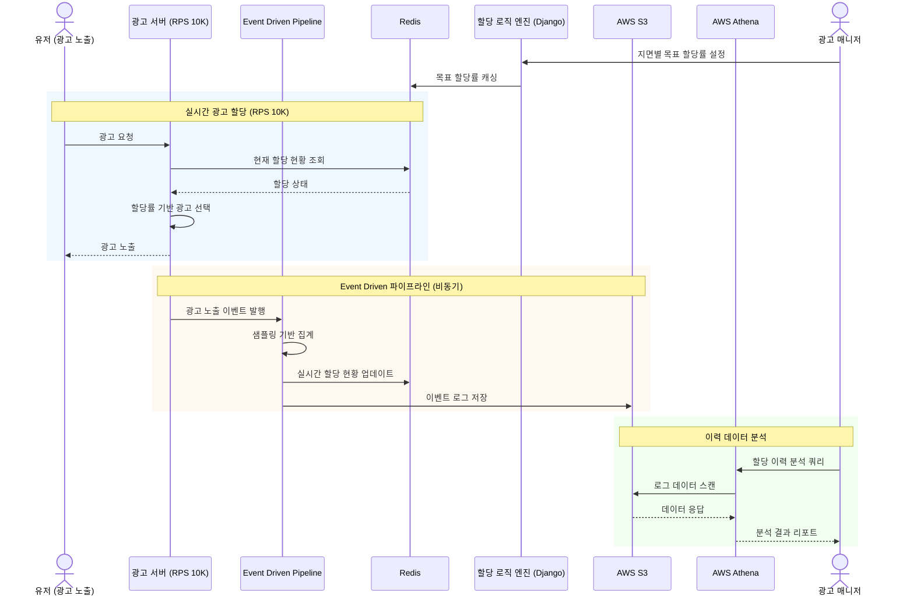

# 버즈빌(Buzzvil)

> 백엔드 엔지니어 | 2021.05 ~ 2021.10

리워드 광고 플랫폼을 운영하는 버즈빌에서 백엔드 엔지니어로 근무하며, 대규모 트래픽 환경에서의 광고 할당 로직 개발 및 OLAP 서버 유지보수를 담당했습니다.

---

## 기술 스택

| 구분 | 기술 |
|------|------|
| **Language** | Python |
| **Framework** | Django |
| **Database / Storage** | Redis, S3 |
| **Analytics** | AWS Athena |
| **Architecture** | Event Driven Pipeline |

---

## 프로젝트 상세

### 1. 광고 할당 로직 작업

대규모 트래픽 **RPS 10,000**인 광고 서버에서, 매니저가 원하는 지면별 광고 할당률에 근사치로 할당시키는 시스템을 개발했습니다.

기술 스택 : Python, Django, S3, Athena, Redis

#### 문제 상황

- 광고 지면별로 매니저가 설정한 목표 할당률이 존재
- 대규모 트래픽(RPS 10K) 환경에서 실시간으로 할당률을 제어해야 하는 요구사항
- 서버에 부하를 주지 않으면서도 정확한 할당이 필요

#### 해결 방안

- **Event Driven 파이프라인** 구축
  - 광고 노출 이벤트를 비동기로 수집하여 실시간 할당 현황 파악
  - 이벤트 기반 아키텍처로 시스템 간 결합도를 낮추고 확장성 확보
- **샘플링 방식** 적용
  - 전수 조사 대신 샘플링 기반으로 할당 현황을 추정
  - 서버 부하를 최소화하면서 매니저가 원하는 신뢰치에 도달
- Redis를 활용한 실시간 카운터 및 할당 상태 캐싱
- S3 + Athena를 활용한 이력 데이터 분석 및 리포팅

#### 성과

- 서버에 부하가 가지 않는 방식으로 매니저가 원하는 신뢰치 도달
- RPS 10K 환경에서 안정적인 광고 할당 시스템 운영

---

### 2. OLAP 서버에 대한 유지보수

광고 데이터 분석을 위한 OLAP(Online Analytical Processing) 서비스의 운영 및 유지보수를 담당했습니다.

#### 서비스 운영

- OLAP 서비스의 전반적인 운영 및 관리
- 서비스 안정성 모니터링 및 장애 대응

#### 기능 확장

- 새로운 Feature 추가에 따른 데이터 프로세싱 파이프라인 수정
- 데이터 수집, 가공, 적재 과정의 유지보수 작업 진행
- 분석 지표 추가 및 데이터 정합성 관리

---

## 아키텍처

### 광고 할당 처리 흐름

