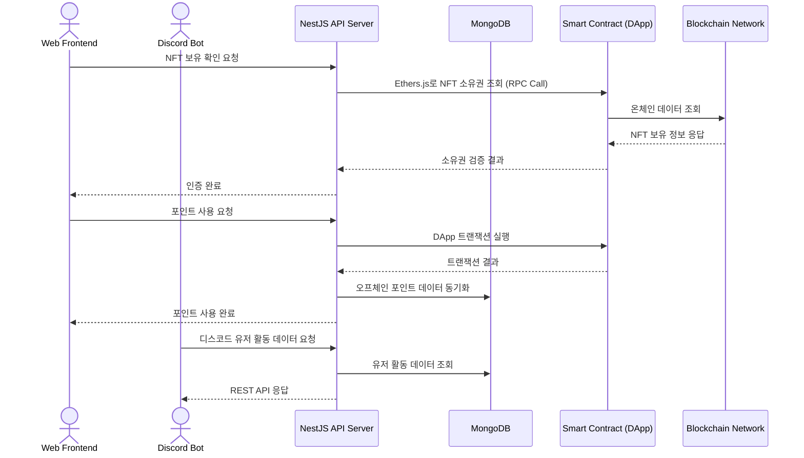
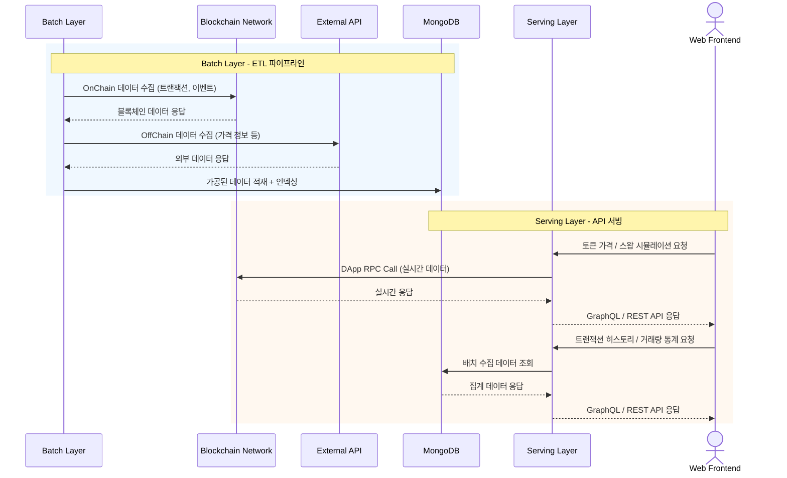
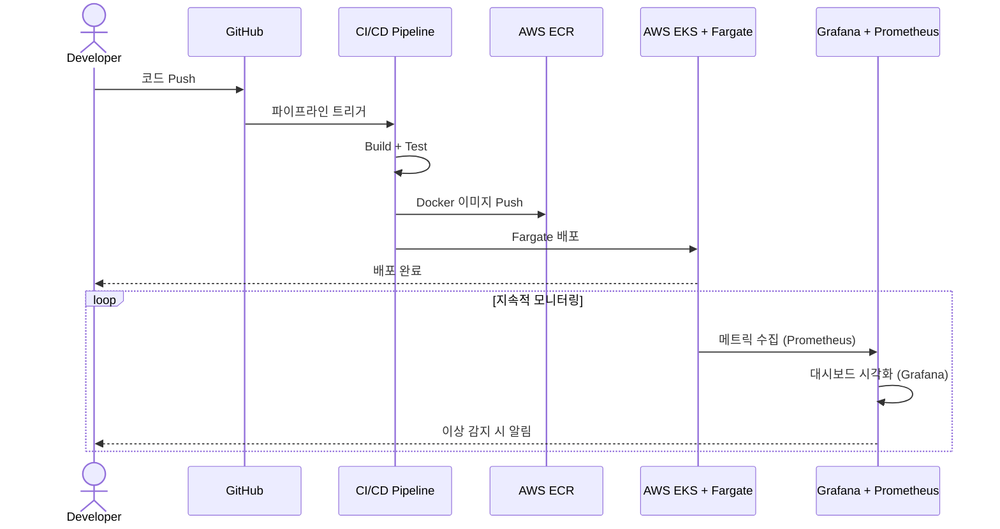

# 수호아이오

> 백엔드 엔지니어 | 2023.04 ~ 2024.03

블록체인 기반 서비스를 운영하는 수호아이오에서 백엔드 엔지니어로 근무하며, 기존 시스템의 인프라 개선과 NFT 플랫폼 및 탈중앙화 거래소(DEX)의 백엔드 개발을 담당했습니다.

---

## 기술 스택

| 구분 | 기술 |
|------|------|
| **Language** | TypeScript |
| **Framework** | NestJS |
| **Database** | MongoDB |
| **Cloud & Infra** | AWS EKS, ECR, Fargate, S3 |
| **DevOps** | CI/CD Pipeline, Docker |
| **Monitoring** | Grafana, Prometheus |
| **Blockchain** | Ethers.js, DApp, RPC |
| **API** | GraphQL, REST API |

---

## 프로젝트 상세

### 1. 백엔드 시스템 개선

백엔드 개발자 없이 MVP로 개발되어 비효율적으로 운영되고 문제점이 많던 백엔드 시스템을 전반적으로 개선하는 작업을 수행했습니다.

#### 컨테이너 인프라 구축

- **AWS EKS 클러스터** 도입으로 컨테이너 오케스트레이션 환경 구축
- **ECR**(Elastic Container Registry)을 활용한 Docker 이미지 관리 체계화
- **Fargate** 도입으로 서버리스 컨테이너 실행 환경 구성, 인프라 관리 부담 감소

#### CI/CD 파이프라인 도입

- 기존 수동 배포 프로세스를 자동화된 CI/CD 파이프라인으로 전환
- 코드 푸시부터 빌드, 테스트, 배포까지의 전체 파이프라인 자동화

#### APM(Application Performance Monitoring) 도입

- **Grafana + Prometheus** 기반 모니터링 시스템 구축
- 서비스 메트릭 수집 및 대시보드를 통한 시스템 상태 가시화
- 장애 발생 시 빠른 인지 및 대응을 위한 알림 체계 구성

#### API 효율성 개선

- API 조회 업무가 많은 서버에 **GraphQL**을 도입
- 클라이언트가 필요한 데이터만 선택적으로 요청할 수 있어 네트워크 효율성 향상
- Over-fetching / Under-fetching 문제 해결

---

### 2. NFT Platform 백엔드 개발

NFT를 보유한 유저들을 위한 플랫폼의 백엔드 서비스를 설계하고 개발했습니다.

기술 스택 : EKS, TypeScript, NestJS, MongoDB, Ethers.js, BlockChain

#### 시스템 설계

- 플랫폼 전체 데이터 모델링 수행
- NFT 보유 유저 검증 및 권한 관리 시스템 설계
- 서비스 아키텍처 설계 및 API 구조 정의

#### 포인트 시스템 개발

- 포인트 사용 관련 **DApp + DB** 상호작용 로직 개발
- 온체인(블록체인) 데이터와 오프체인(DB) 데이터 간의 정합성 보장 로직 구현
- Ethers.js를 활용한 스마트 컨트랙트 연동

#### API 개발

- 프론트엔드 웹 서비스에 필요한 백엔드 REST API 개발
- 디스코드 봇 연동을 위한 백엔드 API 제공
- NFT 메타데이터 조회 및 유저 활동 데이터 API 구현

---

### 3. 블록체인 거래소(DEX) 백엔드 개발

블록체인 탈중앙화 거래소(DEX)에 필요한 백엔드 시스템을 설계하고 개발했습니다.

기술 스택 : EKS, TypeScript, NestJS, MongoDB, Ethers.js, BlockChain

#### Batch Layer

온체인/오프체인 데이터를 수집하고 가공하는 배치 처리 계층을 구현했습니다.

- **OnChain 데이터 ETL**: 블록체인 네트워크에서 발생하는 트랜잭션, 이벤트 등의 데이터를 수집 및 가공
- **OffChain 데이터 ETL**: 외부 API, 가격 정보 등 오프체인 데이터 수집 및 가공
- 수집된 데이터의 MongoDB 적재 및 인덱싱 최적화

#### Serving Layer

실시간 데이터 제공을 위한 API 서빙 계층을 개발했습니다.

- 실시간으로 **DApp에 RPC CALL**을 활용한 비즈니스 로직을 API로 제공
  - 토큰 가격 조회, 유동성 풀 정보, 스왑 시뮬레이션 등
- Batch Layer에서 저장한 수집 데이터를 **GraphQL** 또는 **REST API**로 제공
  - 트랜잭션 히스토리, 유동성 변동 추이, 거래량 통계 등
- 실시간 데이터와 배치 데이터를 조합한 복합 조회 API 구현

---

## 아키텍처

### NFT Platform 서비스 흐름

### DEX 거래소 백엔드 흐름

### 인프라 CI/CD 흐름

